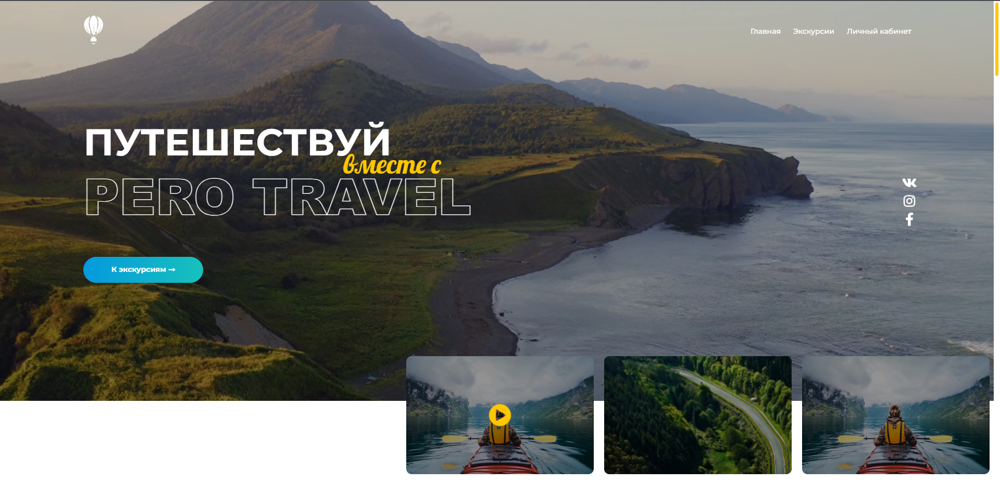

# pero travel
Репозиторий содержит верстку многостраничного лэндинга сайта путешествий Pero Travel

____




____

### Верска выполнена с использование следующих технологий:

* Gulp
* SCSS
* SlickSliders
* FontAwesome 5
* JQuery
___

### Дополнительно

* Реализованы эффекты на странице
* Добавлен адаптив страницы
* Добавлено адаптивное меню под мобильные устройства
* Добавлен прелоадер
* Реализован фон в виде видеофрагмента


[Макет лэндинга](https://www.figma.com/file/Zk4EodctfmM0XbYYO0isXG/pero-travel-(3)-(Copy)?node-id=0%3A1)

[Готовый вариант](https://pero-travel.netlify.app/)

___

``` gulp serve ```  -  запустить проект для разработки

``` gulp build ```  -  запустить проект для сборки

``` gulp clear ```  -  очистить папку сборки

